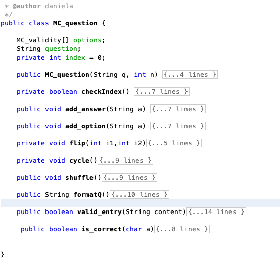
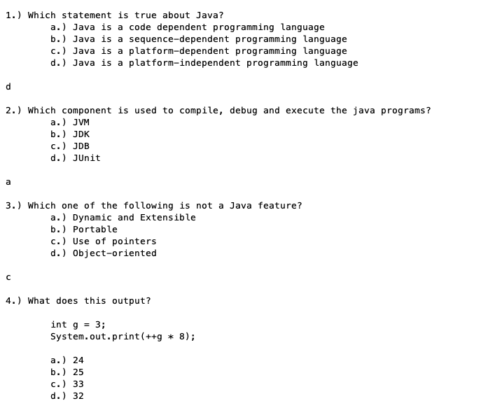
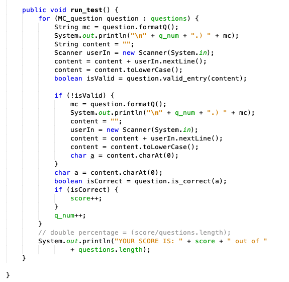

# MultipleChoice

During my freshman year, I developed a Java multiple-choice test program to study for a programming exam. It served as an interactive challenge, combining theory and practice, helping me prepare for midterms and finals. Years later, as part of the Women in Engineering and Computer Science Club, I had the opportunity to run student-led review sessions for the same class. I introduced my program as a "fun" way to study, incorporating both theory and practical application. Recognizing its potential, I decided to share the program, encouraging others to modify and learn from it. It brings me great joy to contribute to the learning community by offering a resource that can be adapted and utilized by fellow students. I hope this program continues to benefit others in their programming journey and exam preparation.

